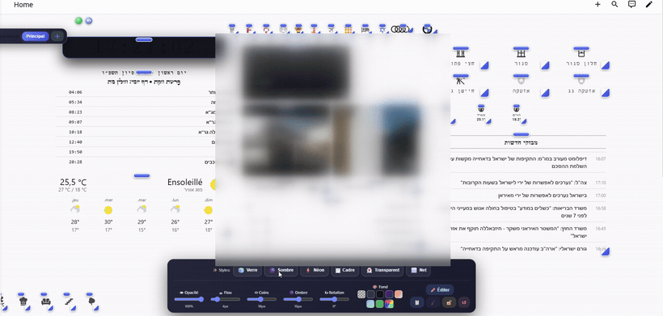

# 🖐️ Freeform Dashboard Editor for Home Assistant

[](https://github.com/hacs/integration)
[](LICENSE)

> Grab **any** card on your Home Assistant dashboard and move, resize, and
> restyle it freely — with the mouse or your finger. No YAML, no rigid grid.

It runs as a lightweight **overlay on your existing dashboard**: your cards stay
real and live (they still update and remain editable in Home Assistant's own
editor). A tiny edit button turns free arranging on and off.



> ⭐ **Like it? [Star the repo](https://github.com/simsoum95/freeform-dashboard) — it helps other Home Assistant users find it.**

---

## ✨ Features

- **Free drag & resize** of any card — including camera streams, swipe/carousel
  cards, and tiny top badges. When you enlarge a card, its **content scales with
  it** (the clock digits get bigger, etc.); when you shrink it, whitespace
  collapses first, then content scales down.
- **Per-card styling, no YAML** — sliders for opacity, blur, rounded corners,
  shadow, and rotation; a background colour picker; and one-tap **presets**
  (Glass · Dark · Neon · Frame · Transparent · Clean).
- **Pro arranging** — magnetic alignment guides while you drag, rubber-band
  multi-select, align / distribute, and bring-to-front / send-to-back.
- **Layout scenes** — save several arrangements (e.g. *Day*, *Night*, *Guests*)
  and switch in one tap. A **separate layout is remembered per screen size**
  (phone / tablet / desktop).
- **Real editing** — double-click any card to open Home Assistant's **native**
  card editor (change the entity, type, options…).
- **Undo / redo**, per-card **lock**, and a **rescue** gesture that brings back
  cards you've dragged off-screen.
- **Internationalised** — English, French, and Hebrew, auto-detected from your
  Home Assistant language, with correct left-to-right **and** right-to-left
  layouts.
- **Syncs across your devices** through Home Assistant's per-user storage.

---

## 📦 Installation

### Via HACS (recommended)

1. In HACS → **⋮** → **Custom repositories**, add this repository with category
   **Dashboard** (Lovelace).
2. Install **Freeform Dashboard Editor**.
3. Add it as a dashboard resource (HACS usually offers to do this for you):

   **Settings → Dashboards → ⋮ → Resources → Add resource**
   - URL: `/hacsfiles/freeform-dashboard/shimon-freeform.js`
   - Type: **JavaScript Module**

### Manual

1. Copy `shimon-freeform.js` to `config/www/`.
2. Add a resource pointing at `/local/shimon-freeform.js` (Type: *JavaScript Module*).

Reload your browser (a hard refresh) after adding the resource.

---

## ⚙️ Configuration

Everything works out of the box. To change which dashboard it activates on, or
the snap-grid size, set a global **before** the resource loads — no need to edit
the file. The simplest place is a tiny extra module resource, or an existing
`<script>` you control:

```js
window.ShimonFreeformConfig = {
  scope: "",   // dashboard path prefix it activates on. "" = every dashboard.
               // e.g. "/lovelace/home" to limit it to one dashboard.
  grid: 8      // snap-to-grid size in pixels
};
```

If you don't set anything, it activates only on the `/dashboard-shimon` path by
default (a deliberately safe default so it never touches other dashboards).
**Most users will want `scope: ""`.**

---

## 🕹️ How to use

A small **circle button** appears near the top of your dashboard:

- **Red** = locked (normal dashboard). **Click → green** = edit mode.
- On first run a hint points at it.

In edit mode:

| Action | How |
|---|---|
| Move a card | Drag the blue handle on top (or long-press the card on touch) |
| Resize a card | Drag the corner handle |
| Style a card | Click it → the style panel appears (sliders, presets, colour, 🔒 lock, ✏️ edit, ↺ reset) |
| Select several | Shift-click, or rubber-band on empty space (mouse) |
| Align / distribute | Select 2+ cards → the align toolbar appears |
| **Open the real HA editor** | **Double-click** a card |
| Rescue stranded cards | **Triple-click** the circle button |
| Switch / create scenes | The scene pills (top-left) |

### Keyboard shortcuts (in edit mode)

| Key | Action |
|---|---|
| `E` | Enter edit mode |
| `Esc` | Exit edit mode |
| `Ctrl/Cmd + Z` | Undo |
| `Ctrl/Cmd + Shift + Z` / `Ctrl + Y` | Redo |
| Arrow keys | Nudge selection (Shift = one grid cell) |

---

## 🛡️ How it stays safe

- It only **reads** your dashboard's rendered cards and positions them with CSS;
  it never rewrites your dashboard YAML. Your cards stay 100% editable in Home
  Assistant's own editor.
- It activates **only** on the configured `scope`, so it can't touch your other
  dashboards.
- Every stored/synced layout value is **validated** before it's applied
  (numbers clamped, backgrounds restricted to safe CSS) — a corrupt or hostile
  record can't paint over your screen or load remote assets.

To wipe all your freeform layouts and start clean, run in the browser console:

```js
window.shimonFreeform.reset()
```

---

## 🤝 Contributing

Issues and pull requests welcome. The whole thing is a single dependency-free
`shimon-freeform.js` (a plain IIFE — no build step). Run `node --check
shimon-freeform.js` before sending a PR.

## 📄 License

[MIT](LICENSE) © simsoum95
